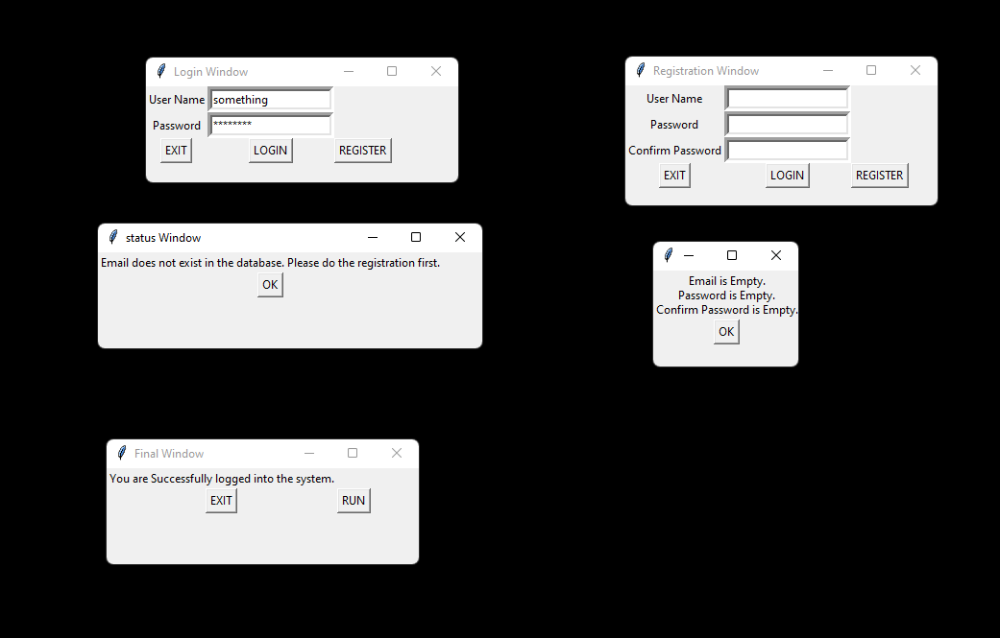

## Proof Of Concept(POC)

This is the first application that I had written a few months back when I was learning python.

A simple UI is created using **Tkinter** library to give log In and Register functionality.

Pandas is used to read the database AKA excel file.

This program uses an excel file as a simple Db to store the username/email and password to authenticate the user.

